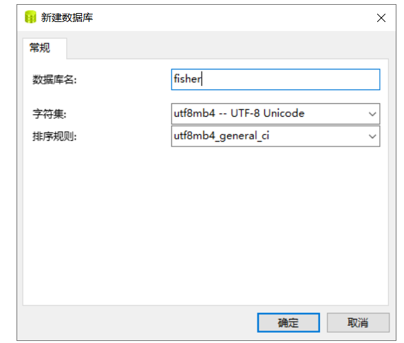

# 欢迎进入第四章-蓝图、模型、CodeFirst
----

第4章 **蓝图、模型、CodeFirst**:

> * 4-1 应用、蓝图与视图函数
> * 4-2 用蓝图注册视图函数
> * 4-3 单蓝图多模块拆分视图函数
> * 4-4 request 对象
> * 4-5 WTForms参数验证
> * 4-6 拆分配置文件
> * 4-7 Model First、Database First与Code First
> * 4-8 定义第一个模型类
> * 4-9 将模型映射到数据库中 
> * 4-10 ORM与CodeFirst区别

> 4-1 -- 4-3蓝图

> 4-7 新建database配置

创建数据库方式：
* Database First
    * mysql客户端直接创建
* Model First
    * mysql客户端 模型选项去画表结构和表与表之间的关系，dba喜欢用
* Code First
