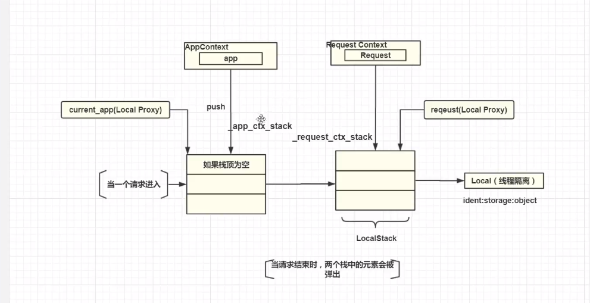

# 欢迎进入第五章-Flask 核心机制
----

第5章 **Flask** 核心机制:

> * 5-1 flask中经典错误 working outside application context
> * 5-2 AppContext、RequestContext、Flask与Request之间的关系
> * 5-3 详解flask上下文与出入栈
> * 5-4 flask上下文与with语句
> * 5-5 详解上下文管理器的__exit__方法
> * 阅读源码解决db.create_all的问题

> 5-2查看全局源码 以下文件都在flask文件夹中（见demoflaskContext.py的笔记）
* app.py --flask核心对象
* ctx.py --上下文源码,点击左边Structure 可以看到2个类 AppContext RequestContext

> 5-3详解flask上下文与出入栈

* 1.应用上下文机制（本质是对象） -- 对Flask的封装  -- ctx.py（源码） -- AppContext类

* 2.请求上下文机制（本质是对象） -- 对Request的封装  -- ctx.py（源码） -- RequextContext类

* 3.查看a = current_app 源码其实是个flask定义德一个代理类型LocalProxy

* 4.查看全局源码： External - Libararies - python - site-packages

    * Flask--配置信息 路由等等
    * AppContext--对Flask封装 并有额外的方法pop push等 入栈 出栈
    * Request -- 保存一些请求信息
    * RequextContext -- 对Request进行封装， 并有额外的方法pop push 入栈 出栈

* 5.从请求进来的 Flask会判断app核心对象的栈是不是空，如果空，会把上下文appContext push进去，所以视图函数分支的代码不会有此问题

* 6.如果右键运行的，没有上下文推送会有这个问题，一般适用于单元测试。
