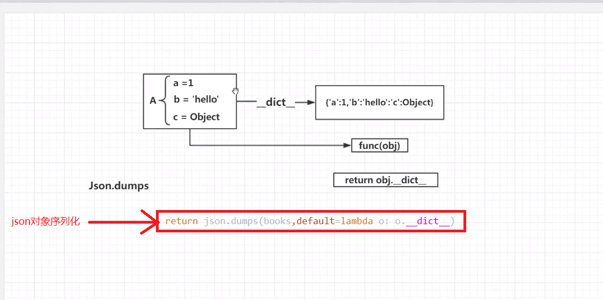

# 欢迎进入第七章-书籍详情页面的构建（ViewModel、面向对象与重构）
----

> * 7-1 ViewModel的基本概念
> * 7-2 使用ViewModel处理书籍数据 上
> * 7-3 使用ViewModel处理书籍数据 下
> * 7-4 伪面向对象：披着面向对象外衣的面向过程
> * 7-5 重构鱼书核心对象：YuShuBook 上
> * 7-6 重构鱼书核心对象：YuShuBook 下
> * 7-7 从json序列化看代码解释权反转 
> * 7-8 详解单页面与网站的区别

1. UI效果图，方便根据需求写API

2. ViewModel概念

3.对象序列化

