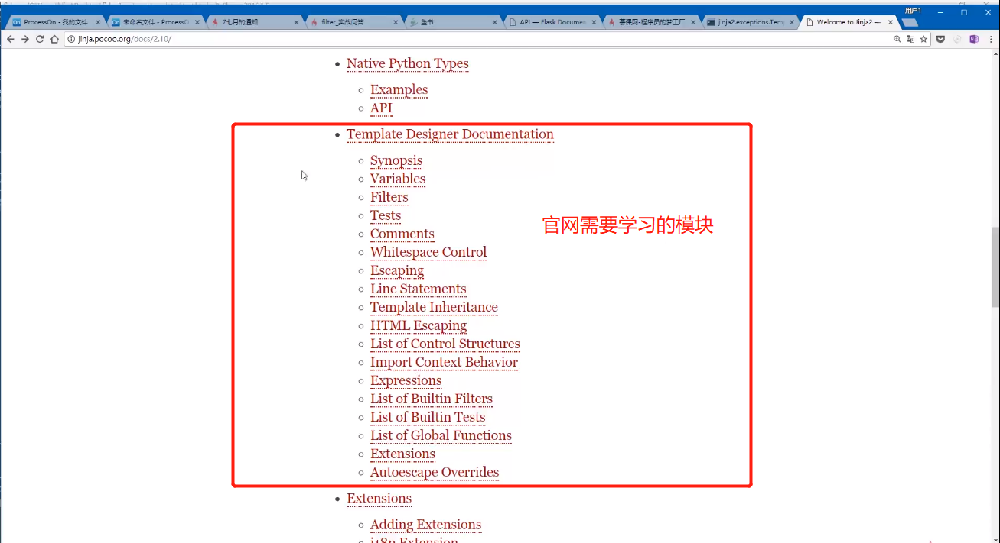

# 欢迎进入第8章 静态文件、模板、消息闪现与Jinja2
----

> * 8-1 静态文件访问原理
> * 8-2 模板文件的位置与修改方案_x264
> * 8-3 Jinja2的概念
> * 8-4 在Jinja2中读取字典和对象
> * 8-5 流程控制语句 if
> * 8-6 流程控制语句 for in 循环
> * 8-7 使用模板继承
> * 8-8 过滤器与管道命令
> * 8-9 反向构建URL
> * 8-10 消息闪现、SecretyKey与变量作用域
> * 8-11 显示搜索结果页面
> * 8-12 页面结构解析

1.Jinjia2模板引擎语言 用来给html渲染数据

